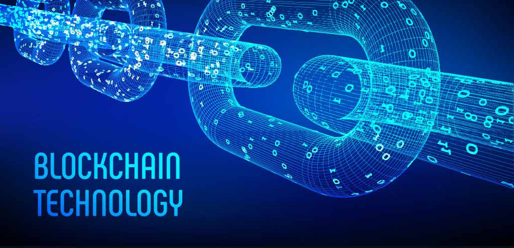

# Blockchain

- No se puede hablar de *Blockchain* sin hablar de *Bitcoin*

- La historia de *Blockchain* inicia de un intento de resolver un problema de información, en el cuál dicha información debía ser igual repartida en todos los participantes de la red.

- Que le dá valor a una moneda/billete
    - basado en la fé al sistema

**Sugerencia:** [this](https://youtu.be/n0iKLfEZOI4)