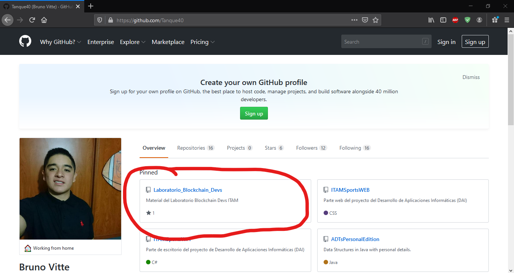
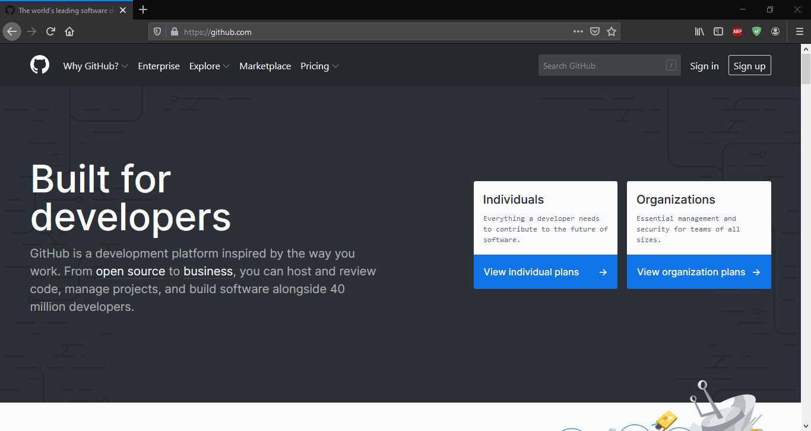

# GitHub

- Comencemos por buscar https://github.com/Tanque40

En el perfil de GitHub el primer repositorio será el que contenga el material que se ocupará en estas sesiones. En caso de no encontrarse en dicha seccion puede buscarse en la sección de *Repositories* con el nombre *Laboratorio_Blockchain_Devs*.

## ¿Qué es GitHub?

- Git

- GitHub

- La web [GitHub](https://github.com/).

La web de GitHub es, entre los entendidos, conocida como la red social de los programadores. Dado que en esta web la gente puede subir sus proyectos de programación, tanto personales como profesionales. La comunidad de progrmadores se va haciendo cargo de, en algún momento, ver el proyecto y revisarlo, en caso de encontrar algún error o una sección en la que se pueda optimizar su uso, se le notifica al dueño y se le solicita algo conocido como [*pull request*](https://help.github.com/en/github/collaborating-with-issues-and-pull-requests/about-pull-requests). Donde, la persona que encontró el error, envía el código que puede fucionar mejor.

GitHub nació de la necesidad de un almacenamiento en la nube y la disponibilidad en tiempo real de los repositorios [Git](https://es.wikipedia.org/wiki/Git) de proyectos en los que trabajaban muchos programadores. Git a resumidas cuentas es un manejador de versiones en el que, usándolo correctamente, se puede evitar la práctica común de tener distintos archivos con los nombres cambiados como: **archivo_De_trabajo.docx**, **archivo_final.docx**, **archivo_finaaaaal.docx**, **archivo_final_este_si.docx**, **archivo_final_este_si_que_si.docx**. Además de permitir trabajar con distintas ramas a modo de partes o experimentos que se deseen hacer.

Si quieres saber más sobre git y su uso con GitHub te recomiendo el siguiente [tutorial](https://youtu.be/HiXLkL42tMU).

Como dato histórico, el 4 de junio de 2018, *Micrososft* anunció la compra de la compañía por 7,500 millones de dólares, cerrando el trato el 26 de octubre de 2018. Desde estonces *Microsoft* ha ido liberando poco a poco el código de las diversas dependencias que lo conforman, permitiendo ver como funcionan a fondo sistemas como [*Windows PowerShell*](https://github.com/MicrosoftDocs/windows-powershell-docs) o [*Microsoft Calculator*](https://github.com/Microsoft/calculator).